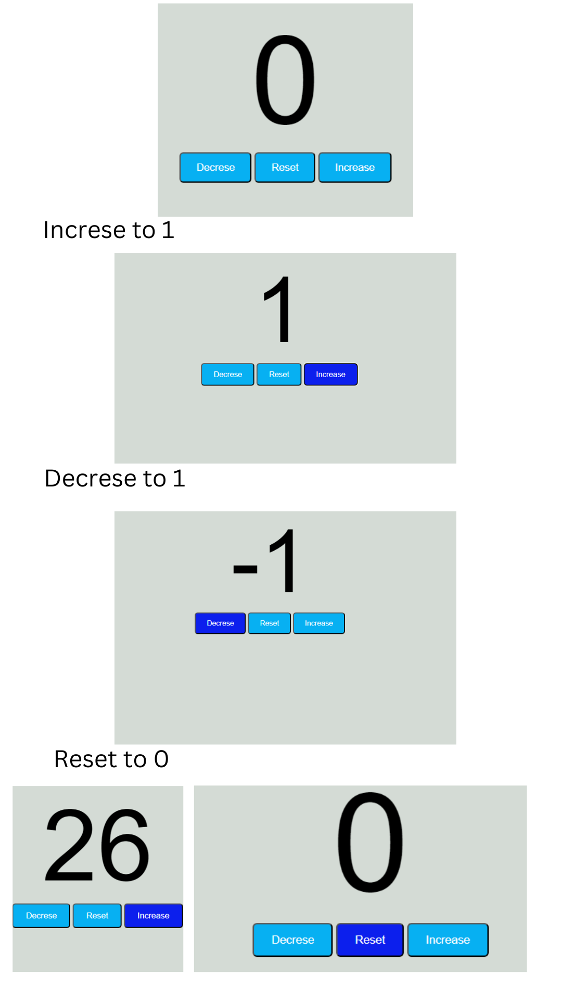

# Number Counter 🔢



# Javascript Code
```
const decreseB =document.getElementById(`decreseB`);
const resetB =document.getElementById(`resetB`);
const increseB =document.getElementById(`increseB`);
const count1 =document.getElementById(`count1`);
let count= 0;
increseB.onclick = function(){
    count ++;
   document.getElementById(`count1`).textContent =count
}
resetB.onclick = function(){
    count=0;
   document.getElementById(`count1`).textContent =count
}
decreseB.onclick = function(){
    count --;
  document.getElementById(`count1`).textContent =count
}
```


